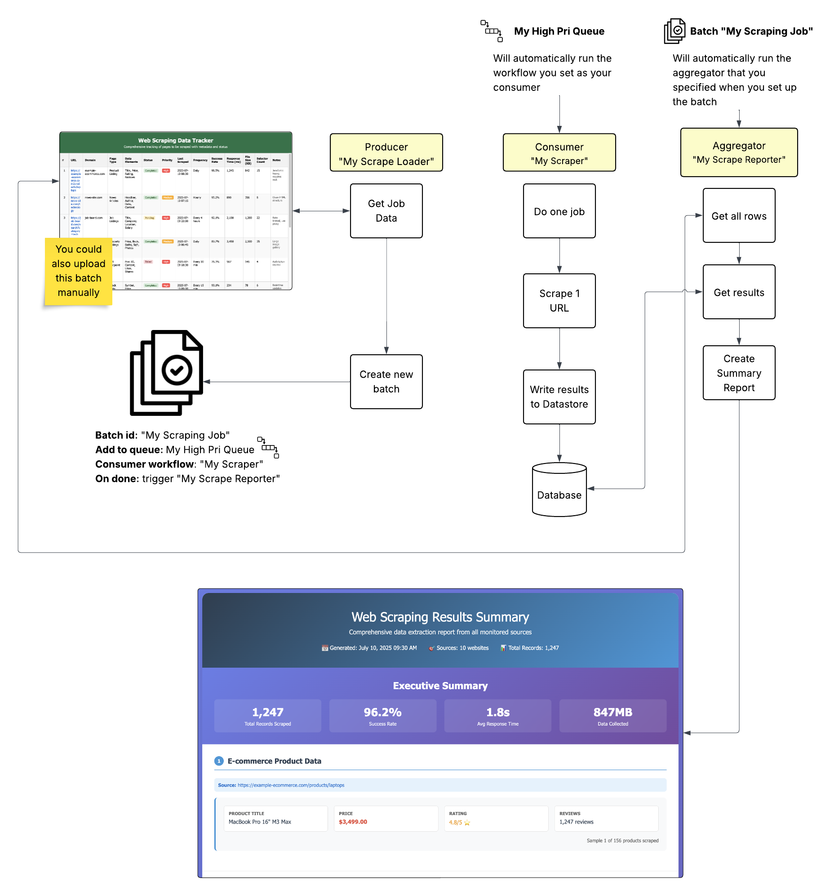

## How Queue Execution Works

Pinkfish uses a modern cloud worker execution model that automatically handles resource management and scaling. Instead of managing individual "robots" or servers, your workflows run on cloud workers that scale automatically based on demand.

### Cloud Worker Architecture

- **Automatic Scaling**: Cloud workers spin up and down based on queue demand
- **Isolation**: Each workflow runs in its own isolated environment
- **Resource Management**: No need to provision or manage infrastructure
- **Cost Efficient**: Pay only for actual execution time

### Concurrency Control

Control how many workflows run simultaneously at two levels:

1. **Customer Concurrency Limit**: Your overall account limit for parallel executions
2. **Queue-Specific Concurrency**: Set per-queue limits for fine-grained control

This replaces traditional "robot management" with a simpler, more scalable approach.

## Queue Management

Create custom queues to organize automation workflows:

- **Queue Name**: Descriptive name for your queue
- **Concurrency**: Control simultaneous job execution
- **Max Retries**: Set retry attempts for failed jobs
- **Priority**: Define queue priority levels

Monitor queues with real-time status showing pending jobs, running jobs, and queue actions.

## Key Features

- **Scalable Processing**: Handle large volumes of automation runs
- **Batch Operations**: Upload and process multiple jobs simultaneously
- **Comprehensive Monitoring**: Full visibility into queue performance via Monitor tab

> **Example**: Example showing use of the queue service to run a big job. 

---

**Questions?** Reach out on Discord https://discord.com/invite/HaDg7R4VZG
