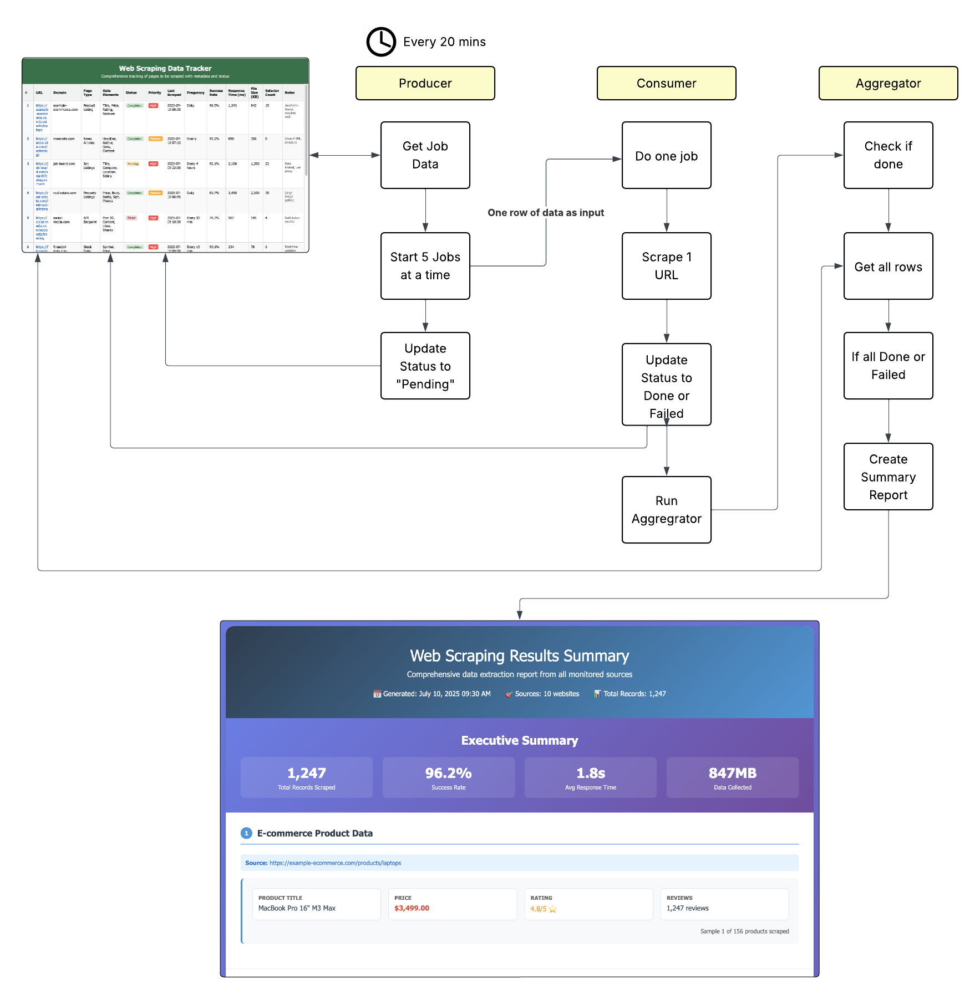

## The Problem: When Your Job is Too Big

Have you tried to create a workflow that needs to process 1000 customer records, send 100 page PDF to the LLM, generate 50 reports, or handle a massive dataset? You might run into these issues:

- **Timeouts**: Workflows can only run for 10 minutes total
- **Complexity**: Large workflows become hard to debug and maintain
- **Failure Risk**: If step 47 out of 50 fails, you lose all your progress
- **Resource Limits**: Processing everything at once can overwhelm systems such as LLMs that can quickly hit context window limits with large amounts of data

## The Solution: The Producer-Consumer Pattern

Think of it like a factory assembly line with three specialized stations:

1. **Producer** (Station 1): Receives the big task and breaks it into individual items in a single batch
2. **Consumer** (Station 2): Processes each batch item one at a time
3. **Aggregator** (Station 3): Collects all the completed batch items and creates the final result

Using Pinkfish's [Queue and Batch services](/essentials/queue), you can orchestrate these three workflows to handle any size batch efficiently.

## How it works

### Workflow 1: Producer

**Purpose**: Break down your big job into individual items in a single batch

This workflow:

- Receives your initial request (e.g., "process 500 customers")
- Uses the Batch service to create a batch with unique batchId
- Breaks the work into individual batch items
- Places all items into a Queue for parallel processing
- Assigns the Consumer automation to process each batch item

### Workflow 2: Consumer

**Purpose**: Process individual batch items and store results

This workflow:

- Gets triggered for each batch item from the queue
- Processes one batch item at a time (e.g., one customer record)
- Stores results in datastore or filestore with batchId metadata
- Marks the batch item as complete
- Handles retries automatically based on queue configuration

### Workflow 3: Aggregator

**Purpose**: Compile final results when all batch items are done

This workflow:

- Gets triggered automatically when the batch completes (using completion actions)
- Retrieves all batch results from datastore/filestore using the batchId
- Compiles the final output (reports, summaries, etc.)
- Sends notifications or delivers final results
- Cleans up temporary data if needed



> **Note**: The easiest way to set up this pattern is to put your producer on a scheduled trigger. Every time it runs it will get a new batch of jobs. Of course, it'll also be running when you have no jobs, but that'll be a simple check and done. The more advanced way to set this up is by creating batch jobs via the Queue service, where the aggregator is set to run on batch done.

## Benefits of the Producer-Consumer Pattern

### 🔄 **Reliability**

- Each workflow is simple and focused
- Failed items retry automatically based on queue max retries
- Batch tracking shows exactly what's complete
- No risk of losing all progress

### 🐛 **Easier Debugging**

- Test each workflow independently
- Clear separation of concerns
- Detailed queue monitoring via Monitor tab
- Easy to identify bottlenecks

### ⚡ **Better Performance**

- Consumers run in parallel based on queue concurrency settings
- Automatic concurrency management
- No resource bottlenecks
- Scales to handle any volume

### 📊 **Progress Tracking**

- Real-time batch monitoring
- See exactly which items are done
- Queue dashboard shows pending and running jobs
- Automatic retry handling

### 🧠 **LLM Optimization**

- Works within LLM context window limits
- Processes large datasets by breaking them into manageable chunks
- Avoids overwhelming AI models with too much data at once
- Enables consistent processing quality across all items

## Best Practices

- **Start Small**: Test with a few batch items before scaling
- **Configure Queues**: Set appropriate concurrency and retry limits for your use case
- **Monitor Performance**: Use queue dashboard to optimize processing
- **Handle Failures**: Design consumer to be fault-tolerant
- **Store Results**: Use datastore for metadata, filestore for large outputs (always include batchId for easy aggregation)
- **Set Completion Actions**: Configure batch completion to trigger your aggregator workflow
- **Clean Up**: Use aggregator to archive or delete temporary data

The Producer-Consumer pattern transforms complex, risky workflows into reliable, scalable systems. By breaking big jobs into three focused workflows and leveraging the Queue and Batch services, you get better performance, easier debugging, and complete visibility into your automation processes.

## Example Use Case: Summarizing a 1000 page document

Using the Producer/Consumer Pattern for Large Document Processing where the content exceeds the LLM context window.

### 1. Producer Workflow: Split and Batch

**Purpose**: Break your 1000-page document into manageable chunks and create a batch job.

This workflow should:

- Use the `/pdf-splitter` skill to split your large document into smaller chunks; each chunk will be deposited into the Filestore collection of your choice.
- Create a new Batch Job where each input will have the name of the file to process.

```
/pdf-splitter
collectionId: YOUR_COLLECTION_ID
file: your-1000-page-document.pdf
pages per chunk: 5
metadata: {"project": "document-summary", "originalDoc": "large-document.pdf"}
```

The PDF splitter will create multiple smaller PDF files (e.g., 200 files of 5 pages each) and store them in your specified collection.

Then create the Batch

```
Batch Skill Details coming soon!
- Post new batch
- Each input is the chunk filename
- Set worker to Consumer
- Set onDone Trigger to Aggregator
```

### 2. Consumer Workflow: Summarize Chunks

**Purpose**: Process individual document chunks and extract summaries

This workflow gets triggered for each chunk and should:

- Receive one document chunk filename
- Use `/pdf-analysis` or LLM of your choice to process the chunk with an LLM
- Store the summary results in the datastore with the batchId for later aggregation

```
/pdf-analysis
pdf-file: [chunk from queue]
prompt: summarize this document chunk concisely making sure that key details about [YOUR AREA OF INTEREST] are maintained
format: json
```

Then store the result

```
/datastore
action: write
key: [jobname]_[batchId]
sortField: [chunkNumber]
content: [summary result]
```

### 3. Aggregator Workflow: Stitch and Smooth

**Purpose**: Combine all chunk summaries into a comprehensive final summary

This workflow gets triggered when the batch completes and should:

- Retrieve all chunk summaries from the datastore using the batchId
- Use an LLM to synthesize the individual summaries into a cohesive final summary
- Deliver the final result

```
/datastore
action: retrieve all items with key: [jobname]_[batchId]

/summarization
prompt: stitch together a comprehensive summary from these parts. Note that each of these individual summaries come from one document that was split and where each split chunk was summarized, so you'll need to be smart about smoothing the transitions between chunks.
content: [combined chunk summaries sorted from first chunk to last chunk]
action: create comprehensive summary
format: markdown
```

When you're done, you should have a combined summary from all of the parts - where the LLM has stitched together results and smoothed over the splits. You may need to experiment with the summarization prompt. _Try with small documents first to make sure its doing what you want._

---

**Note**: This pattern is also known as the **Work Queue Pattern**, **Batch Processing Pattern**, or **Fan-out/Fan-in Pattern** in computer science.

For more details on Queue and Batch service configuration, see the [Queue Service documentation](/essentials/queue).

---

**Questions?** Reach out on Discord https://discord.com/invite/HaDg7R4VZG
